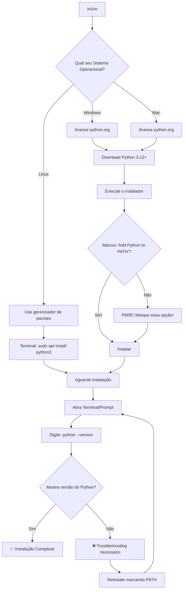
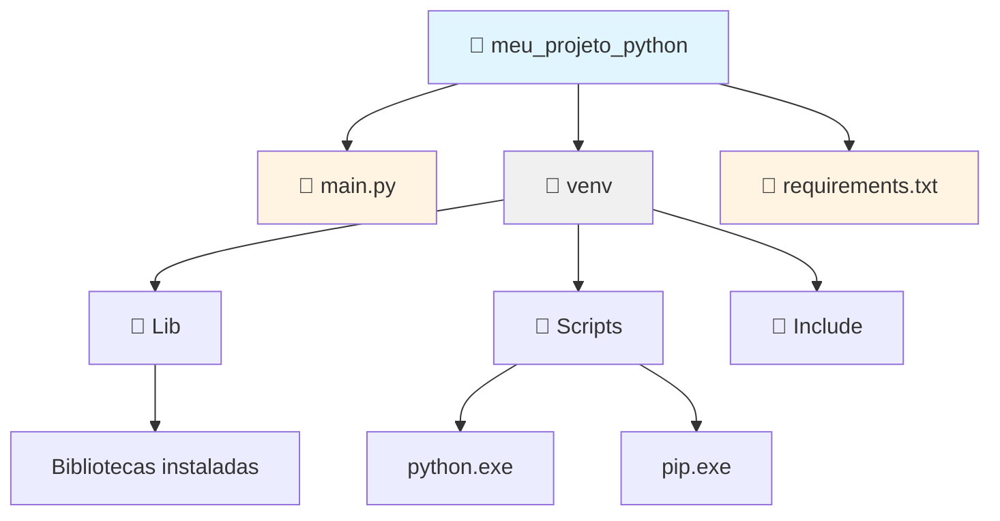
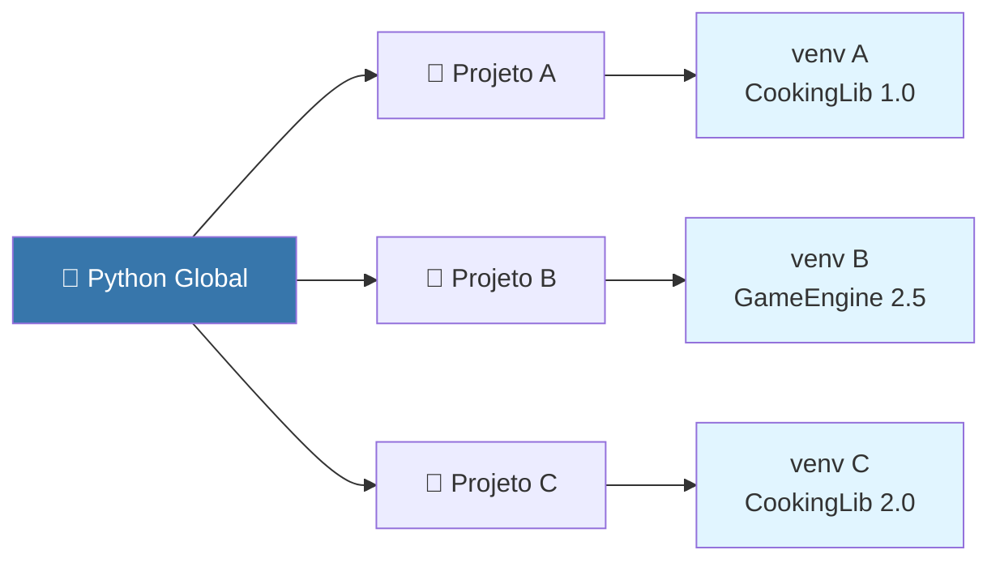
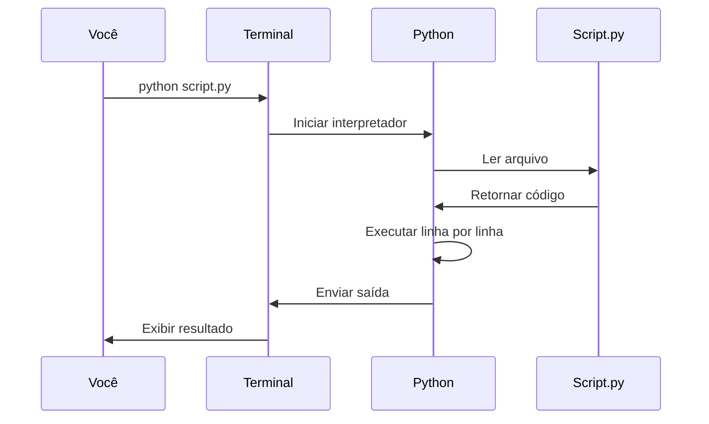
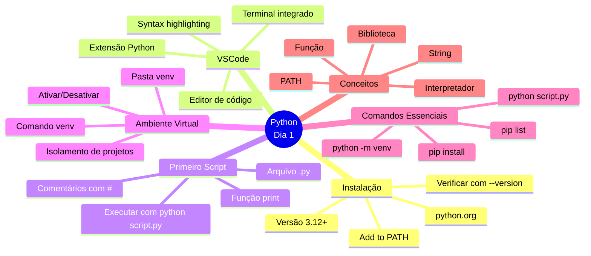

# 🐍 Python para Iniciantes - Dia 1: Seu Primeiro Laboratório de Código

---

## 📋 OBJETIVOS DE APRENDIZAGEM DO DIA

Ao final deste material, você será capaz de:

1. **Instalar** o Python corretamente no seu sistema operacional (Windows, Linux ou Mac)
2. **Configurar** o VSCode com a extensão Python para criar seu ambiente de desenvolvimento
3. **Criar e executar** seu primeiro script Python que exibe mensagens na tela
4. **Explicar** o que é um ambiente virtual e criar um usando venv
5. **Utilizar** os 3 comandos essenciais: `python script.py`, `python -m venv` e `pip`

---

## 🎭 ATIVAÇÃO DO CONHECIMENTO PRÉVIO

### Perguntas para Reflexão:
- Você já usou algum aplicativo no celular ou computador? (Spoiler: todos eles foram programados!)
- Já seguiu uma receita de bolo? Programar é muito parecido: você dá instruções passo a passo!
- Você sabe o que acontece quando clica em "Enviar" em um formulário online?

### 🔬 Analogia Central: Python como um Laboratório de Cientista

Imagine que você acabou de ganhar seu próprio **laboratório científico**. Neste laboratório:

- **Python** é a linguagem que você usa para dar comandos aos seus equipamentos
- **VSCode** é a sua bancada de trabalho organizada, com todas as ferramentas à mão
- **Scripts** são suas receitas de experimentos, escritas em um caderno
- **Ambiente Virtual (venv)** é como ter uma sala limpa e isolada para cada experimento, evitando que substâncias de um experimento contaminem outro
- **pip** é o catálogo onde você pede novos equipamentos e reagentes para seus experimentos

Hoje, você vai montar seu laboratório do zero e fazer seu primeiro experimento: criar um programa que se apresenta para o mundo!

### 📖 História Introdutória

Ana sempre foi curiosa. Quando criança, desmontava brinquedos para ver como funcionavam. Na adolescência, se perguntava: "Como o Instagram sabe quais fotos me mostrar?" ou "Como o Spotify escolhe músicas que eu vou gostar?". 

Um dia, ela descobriu que por trás de cada aplicativo, site ou jogo existe **código** - instruções escritas em linguagens que computadores entendem. E a melhor parte? **Qualquer pessoa pode aprender a programar!**

Ana escolheu Python como primeira linguagem porque é como português: fácil de ler e entender. Em poucas semanas, ela criou seu primeiro programa que organizava sua lista de tarefas. Hoje, você está no mesmo ponto de partida que Ana estava. E sabe o que é incrível? Você vai percorrer em um dia o que levaria semanas descobrindo sozinho!

---

## 📚 APRESENTAÇÃO DO CONTEÚDO

### 🧩 Bloco 1: O que é Python?

**Python** é uma linguagem de programação criada em 1991 por Guido van Rossum. Ele queria uma linguagem **fácil de ler** e **poderosa**.

**Analogia:** Se linguagens de programação fossem idiomas humanos, Python seria como o esperanto - foi criado para ser simples e lógico. Outras linguagens (como C++) seriam como alemão - poderosas, mas com muitas regras complexas.

**Python é usado para:**
- 🌐 Sites (Instagram, Spotify, YouTube)
- 🤖 Inteligência Artificial (ChatGPT, reconhecimento facial)
- 📊 Análise de dados (ciência de dados, gráficos)
- 🎮 Jogos (Battlefield 2, Civilization IV)
- 🔧 Automação (tarefas repetitivas no computador)

---

### 🧩 Bloco 2: Instalação do Python

#### 📊 Fluxograma do Processo de Instalação



---

#### 🪟 Instalação no Windows (Passo a Passo DETALHADO)

**PASSO 1:** Abra seu navegador (Chrome, Edge, Firefox)

**PASSO 2:** Digite na barra de endereços: `www.python.org`

**PASSO 3:** Você verá a página inicial do Python. Procure o botão amarelo grande escrito **"Downloads"**

**PASSO 4:** Clique em **"Download Python 3.12.x"** (o número pode variar, mas deve ser 3.10 ou superior)

**PASSO 5:** Aguarde o download terminar (arquivo com nome tipo `python-3.12.0-amd64.exe`)

**PASSO 6:** Vá até a pasta **Downloads** e clique duas vezes no arquivo baixado

**PASSO 7:** ⚠️ **ATENÇÃO - PASSO MAIS IMPORTANTE!** ⚠️
- Na primeira tela do instalador, você verá duas caixinhas para marcar
- **MARQUE A CAIXINHA:** ☑️ **"Add python.exe to PATH"**
- Isso é como adicionar o Python na "agenda de contatos" do Windows
- Sem isso, o computador não saberá onde encontrar o Python!

**PASSO 8:** Clique em **"Install Now"** (Instalar Agora)

**PASSO 9:** Windows pode pedir permissão de administrador - clique em **"Sim"**

**PASSO 10:** Aguarde a barra de progresso completar (1-3 minutos)

**PASSO 11:** Quando aparecer **"Setup was successful"**, clique em **"Close"**

**PASSO 12:** Vamos testar! Pressione as teclas `Windows + R` juntas

**PASSO 13:** Digite `cmd` e pressione Enter (abre o Prompt de Comando)

**PASSO 14:** No Prompt, digite:
```
python --version
```

**PASSO 15:** Se aparecer algo como `Python 3.12.0`, **PARABÉNS! 🎉** Python instalado!

---

#### 🍎 Instalação no Mac (Passo a Passo DETALHADO)

**PASSO 1:** Abra o Safari ou Chrome

**PASSO 2:** Acesse `www.python.org`

**PASSO 3:** Clique em **"Downloads"**

**PASSO 4:** Clique em **"Download Python 3.12.x for macOS"**

**PASSO 5:** Aguarde o download do arquivo `.pkg`

**PASSO 6:** Vá até a pasta **Downloads** e clique duas vezes no arquivo

**PASSO 7:** Clique em **"Continuar"** em todas as telas

**PASSO 8:** Quando pedir senha, digite a senha do seu Mac

**PASSO 9:** Clique em **"Instalar"**

**PASSO 10:** Aguarde a instalação (2-4 minutos)

**PASSO 11:** Clique em **"Fechar"**

**PASSO 12:** Abra o **Terminal** (Cmd + Espaço, digite "Terminal")

**PASSO 13:** Digite:
```
python3 --version
```

**PASSO 14:** Se aparecer `Python 3.12.0`, **SUCESSO! 🎉**

**Nota:** No Mac, você usa `python3` (com o 3) ao invés de apenas `python`

---

#### 🐧 Instalação no Linux (Ubuntu/Debian)

**PASSO 1:** Abra o Terminal (Ctrl + Alt + T)

**PASSO 2:** Atualize a lista de pacotes:
```bash
sudo apt update
```

**PASSO 3:** Instale o Python:
```bash
sudo apt install python3 python3-pip python3-venv
```

**PASSO 4:** Digite sua senha quando solicitado

**PASSO 5:** Pressione `S` ou `Y` para confirmar

**PASSO 6:** Aguarde a instalação

**PASSO 7:** Teste com:
```bash
python3 --version
```

**PASSO 8:** Se aparecer a versão, **PRONTO! 🎉**

---

### 🧩 Bloco 3: Instalação e Configuração do VSCode

#### O que é o VSCode?

**Visual Studio Code (VSCode)** é um **editor de código** - um programa especial para escrever código.

**Analogia:** Se Python é o idioma que você vai falar, VSCode é o caderno especial onde você escreve. Ele tem:
- ✨ **Corretor ortográfico** para código (mostra erros)
- 🎨 **Cores diferentes** para palavras diferentes (mais fácil de ler)
- 🔍 **Lupa** para encontrar coisas no código
- 🤖 **Sugestões inteligentes** enquanto você digita

---

#### 📥 Instalação do VSCode

**PASSO 1:** Acesse `code.visualstudio.com`

**PASSO 2:** Clique no botão grande **"Download"**

**PASSO 3:** O site detecta seu sistema automaticamente (Windows/Mac/Linux)

**PASSO 4:** Aguarde o download

**PASSO 5:** Execute o instalador baixado

**PASSO 6 (Windows):**
- Marque ☑️ **"Add to PATH"**
- Marque ☑️ **"Create a desktop icon"** (cria ícone na área de trabalho)
- Clique **"Next"** até terminar

**PASSO 6 (Mac):**
- Arraste o ícone do VSCode para a pasta **Applications**

**PASSO 6 (Linux):**
- Siga as instruções na tela ou use:
```bash
sudo snap install code --classic
```

**PASSO 7:** Abra o VSCode (clique no ícone criado)

---

#### 🔌 Instalação da Extensão Python

**PASSO 1:** Com o VSCode aberto, olhe para o lado esquerdo da janela

**PASSO 2:** Você verá ícones verticais. Clique no ícone que parece **4 quadradinhos** (Extensions/Extensões)

**PASSO 3:** Na caixa de busca que aparece, digite: `Python`

**PASSO 4:** O primeiro resultado será **"Python"** da **Microsoft** (com logo azul/amarelo)

**PASSO 5:** Clique em **"Install"** (Instalar)

**PASSO 6:** Aguarde (30 segundos a 1 minuto)

**PASSO 7:** Quando o botão mudar para **"Installed"**, está pronto! ✅

**O que essa extensão faz?**
- 🎨 Colore seu código Python (syntax highlighting)
- 🐛 Ajuda a encontrar erros (linting)
- 💡 Dá sugestões enquanto você digita (IntelliSense)
- ▶️ Permite executar código com um clique

---

### 🧩 Bloco 4: Estrutura de um Projeto Python

#### 📊 Diagrama de Estrutura de Diretórios



**Explicação da estrutura:**

- **📁 meu_projeto_python** = Pasta principal (como uma caixa que guarda tudo)
- **📄 main.py** = Seu arquivo de código Python (a receita do experimento)
- **📁 venv** = Ambiente virtual (sala limpa e isolada)
- **📄 requirements.txt** = Lista de bibliotecas necessárias (lista de compras)

---

### 🧩 Bloco 5: Criando Seu Primeiro Script Python

#### 🎬 Screencast Textual: Criando "Hello World"

**CENA 1: Criando a pasta do projeto**

```
[Você abre o Explorador de Arquivos]
[Navega até Documentos]
[Clica com botão direito > Novo > Pasta]
[Nomeia a pasta: meu_primeiro_python]
[Pressiona Enter]
```

**CENA 2: Abrindo a pasta no VSCode**

```
[Você abre o VSCode]
[Clica em File > Open Folder (Arquivo > Abrir Pasta)]
[Seleciona a pasta meu_primeiro_python]
[Clica em "Selecionar Pasta"]
```

**CENA 3: Criando o arquivo Python**

```
[No VSCode, você vê o explorador de arquivos à esquerda]
[Clica no ícone "Novo Arquivo" (página com +)]
[Digita o nome: ola_mundo.py]
[Pressiona Enter]
[Um arquivo em branco abre no editor]
```

**CENA 4: Escrevendo o código**

```python
# Meu primeiro programa em Python!
print("Olá, mundo!")
print("Meu nome é [SEU NOME]")
print("Hoje eu comecei a programar!")
```

**CENA 5: Salvando o arquivo**

```
[Pressiona Ctrl + S (Windows/Linux) ou Cmd + S (Mac)]
[O ponto branco ao lado do nome do arquivo desaparece]
[Arquivo salvo!]
```

**CENA 6: Executando o código**

```
[Clica com botão direito no código]
[Seleciona "Run Python File in Terminal"]
[OU pressiona o botão ▶️ no canto superior direito]
[O Terminal aparece na parte inferior]
[Você vê a saída:]

Olá, mundo!
Meu nome é [SEU NOME]
Hoje eu comecei a programar!
```

**🎉 PARABÉNS! Você acabou de criar e executar seu primeiro programa!**

---

#### 🔬 Anatomia do "Hello World" - Linha por Linha

Vamos dissecar o código como um cientista:

```python
# Meu primeiro programa em Python!
```

**O que é:** Comentário
**Para que serve:** Anotações para humanos lerem. Python ignora tudo depois do `#`
**Analogia:** Como escrever no caderno "Lembrar: esta receita serve 4 pessoas"

---

```python
print("Olá, mundo!")
```

**Dissecando:**
- `print` = **função** que exibe texto na tela
- `(` e `)` = parênteses que envolvem o que você quer exibir
- `"Olá, mundo!"` = **string** (texto) entre aspas
- Ponto e vírgula? **NÃO PRECISA!** Python não usa `;` no final

**Analogia:** `print` é como um megafone. Você coloca uma mensagem dentro e ele grita para todo mundo ouvir (na tela).

**Por que aspas?** Para Python saber que é texto, não código. Sem aspas, Python tentaria procurar uma variável chamada "Olá".

---

### 🧩 Bloco 6: Ambiente Virtual (venv)

#### O que é um Ambiente Virtual?

**Definição simples:** Uma cópia isolada do Python só para seu projeto.

**Analogia Detalhada:**

Imagine que você tem 3 projetos:
1. **Projeto A:** Aplicativo de receitas (precisa da biblioteca "CookingLib" versão 1.0)
2. **Projeto B:** Jogo de xadrez (precisa da biblioteca "GameEngine" versão 2.5)
3. **Projeto C:** Análise de dados (precisa da biblioteca "CookingLib" versão 2.0)

**PROBLEMA:** Se você instalar tudo no mesmo Python, as versões vão conflitar! É como tentar usar o mesmo laboratório para experimentos incompatíveis.

**SOLUÇÃO:** Ambiente virtual! Cada projeto tem sua própria "sala limpa" com suas próprias bibliotecas.



---

#### 🛠️ Criando um Ambiente Virtual

**PASSO 1:** Abra o Terminal no VSCode (Terminal > New Terminal)

**PASSO 2:** Certifique-se de estar na pasta do projeto:
```bash
# Você deve ver algo como:
# C:\Users\SeuNome\Documents\meu_primeiro_python>
```

**PASSO 3:** Crie o ambiente virtual:

**Windows:**
```bash
python -m venv venv
```

**Mac/Linux:**
```bash
python3 -m venv venv
```

**Explicando o comando:**
- `python` = chama o Python
- `-m` = "execute um módulo"
- `venv` (primeiro) = nome do módulo que cria ambientes virtuais
- `venv` (segundo) = nome da pasta que será criada

**Analogia:** `python -m venv venv` é como dizer "Python, use seu módulo de construção de laboratórios para criar um laboratório chamado venv"

**PASSO 4:** Aguarde (10-30 segundos). Uma pasta `venv` será criada.

---

#### ⚡ Ativando o Ambiente Virtual

**Windows:**
```bash
venv\Scripts\activate
```

**Mac/Linux:**
```bash
source venv/bin/activate
```

**Como saber se ativou?**
Você verá `(venv)` no início da linha do terminal:
```bash
(venv) C:\Users\SeuNome\Documents\meu_primeiro_python>
```

**Analogia:** Ativar o ambiente é como entrar na sala limpa e fechar a porta. Agora tudo que você fizer (instalar bibliotecas) fica dentro dessa sala.

---

#### 🚪 Desativando o Ambiente Virtual

Quando terminar de trabalhar:
```bash
deactivate
```

O `(venv)` desaparece. Você "saiu da sala limpa".

---

### 🧩 Bloco 7: Comandos Essenciais

#### 📊 Sequência de Execução de Código



---

#### 1️⃣ Comando: `python script.py`

**O que faz:** Executa um arquivo Python

**Sintaxe:**
```bash
python nome_do_arquivo.py
```

**Exemplo:**
```bash
python ola_mundo.py
```

**Analogia:** É como dizer "Python, leia esta receita (script) e execute as instruções"

**Quando usar:** Sempre que quiser rodar seu código!

---

#### 2️⃣ Comando: `python -m venv nome_pasta`

**O que faz:** Cria um ambiente virtual

**Sintaxe:**
```bash
python -m venv nome_da_pasta
```

**Exemplo:**
```bash
python -m venv meu_ambiente
```

**Partes do comando:**
- `python` = interpretador Python
- `-m` = "module" (módulo)
- `venv` = módulo de ambiente virtual
- `nome_pasta` = nome que você escolhe

**Quando usar:** Uma vez por projeto, no início

---

#### 3️⃣ Comando: `pip install nome_biblioteca`

**O que é pip?** **P**ip **I**nstalls **P**ackages (Pip Instala Pacotes)

**O que faz:** Instala bibliotecas (código feito por outras pessoas)

**Sintaxe:**
```bash
pip install nome_da_biblioteca
```

**Exemplos:**
```bash
pip install requests      # Para fazer requisições web
pip install pandas        # Para análise de dados
pip install pygame        # Para criar jogos
```

**Analogia:** pip é como uma loja de ferramentas. Você pede uma ferramenta pelo nome e ela é entregue no seu laboratório.

**Quando usar:** Quando precisar de funcionalidades extras que Python não tem por padrão

---

#### 📋 Outros Comandos Úteis

```bash
# Ver versão do Python
python --version

# Ver versão do pip
pip --version

# Listar bibliotecas instaladas
pip list

# Desinstalar uma biblioteca
pip uninstall nome_biblioteca

# Atualizar pip
python -m pip install --upgrade pip

# Criar arquivo de requisitos (lista de bibliotecas)
pip freeze > requirements.txt

# Instalar de um arquivo de requisitos
pip install -r requirements.txt
```

---

### 📖 GLOSSÁRIO DE TERMOS TÉCNICOS

| Termo | Definição Simples | Analogia |
|-------|------------------|----------|
| **Python** | Linguagem de programação | O idioma que você fala com o computador |
| **Script** | Arquivo com código Python (.py) | Receita de bolo escrita no caderno |
| **Interpretador** | Programa que lê e executa Python | Tradutor que converte suas instruções |
| **IDE** | Editor de código (ex: VSCode) | Caderno especial com corretor ortográfico |
| **Terminal** | Janela de comandos de texto | Telefone direto com o computador |
| **Ambiente Virtual** | Python isolado para um projeto | Sala limpa de laboratório |
| **Biblioteca/Package** | Código pronto feito por outros | Ferramenta comprada na loja |
| **pip** | Instalador de bibliotecas | Entregador de ferramentas |
| **Função** | Bloco de código reutilizável | Máquina que faz uma tarefa específica |
| **String** | Texto entre aspas | Palavras e frases |
| **Comentário** | Texto que Python ignora (#) | Anotações no caderno |
| **PATH** | Lista de onde o sistema procura programas | Agenda de contatos do Windows |
| **Extensão** | Plugin que adiciona funcionalidades | Acessório que melhora uma ferramenta |

---

## 💡 DEMONSTRAÇÃO E MODELAGEM

### Exemplo Completo: Programa de Boas-Vindas

Vamos criar um programa mais elaborado que demonstra vários conceitos:

```python
# ========================================
# PROGRAMA: Boas-vindas Personalizado
# AUTOR: Seu Nome
# DATA: 2026-01-05
# DESCRIÇÃO: Programa que cumprimenta o usuário
# ========================================

# 1. EXIBIR TÍTULO
print("=" * 40)  # Imprime 40 sinais de igual
print("🎉 BEM-VINDO AO PYTHON! 🎉")
print("=" * 40)

# 2. LINHA EM BRANCO (para organização visual)
print()

# 3. MENSAGEM PRINCIPAL
print("Olá! Este é meu primeiro programa Python.")
print("Estou aprendendo a programar!")

# 4. OUTRA LINHA EM BRANCO
print()

# 5. INFORMAÇÕES SOBRE PYTHON
print("📚 Curiosidades sobre Python:")
print("   • Criado em 1991")
print("   • Nome inspirado em Monty Python")
print("   • Usado por Google, Netflix, NASA")

# 6. DESPEDIDA
print()
print("Até a próxima! 👋")
print("=" * 40)
```

**Saída esperada:**
```
========================================
🎉 BEM-VINDO AO PYTHON! 🎉
========================================

Olá! Este é meu primeiro programa Python.
Estou aprendendo a programar!

📚 Curiosidades sobre Python:
   • Criado em 1991
   • Nome inspirado em Monty Python
   • Usado por Google, Netflix, NASA

Até a próxima! 👋
========================================
```

---

### 🔍 Análise Detalhada do Código

#### Linha 1-5: Cabeçalho com Comentários
```python
# ========================================
# PROGRAMA: Boas-vindas Personalizado
```

**Por que fazer isso?**
- Organização profissional
- Você (no futuro) saberá o que é o programa
- Outros programadores entenderão seu código

---

#### Linha 8: Repetição de Caracteres
```python
print("=" * 40)
```

**Mágica do Python!** O operador `*` com strings **repete** o texto.

**Exemplos:**
```python
print("Ha" * 3)      # Saída: HaHaHa
print("-" * 10)      # Saída: ----------
print("🎉" * 5)      # Saída: 🎉🎉🎉🎉🎉
```

**Analogia:** É como pedir para o Python "escreva '=' 40 vezes"

---

#### Linha 13: Print Vazio
```python
print()
```

**O que faz:** Imprime uma linha em branco

**Por que usar:** Deixa o texto mais legível, com espaçamento

**Analogia:** Como dar um "Enter" no Word para pular linha

---

#### Linha 21: Caracteres Especiais (Emojis)
```python
print("📚 Curiosidades sobre Python:")
```

**Sim, Python aceita emojis!** Você pode usar 😀🎉🚀 no seu código.

**Como adicionar emojis:**
- Windows: Tecla Windows + . (ponto)
- Mac: Cmd + Ctrl + Espaço
- Linux: Ctrl + . (ou copie da web)

---

## 🎯 PRÁTICA GUIADA

### Exercício Principal: Cartão de Visitas Digital 🎴

#### 📌 Contexto e Motivação

Você foi contratado como desenvolvedor júnior em uma startup. Seu primeiro desafio é criar um programa que exibe um **cartão de visitas digital** no terminal. Este cartão será usado em eventos de tecnologia para você se apresentar de forma criativa!

**Por que este exercício?**
- ✅ Pratica `print()` de várias formas
- ✅ Usa formatação e organização visual
- ✅ Cria algo pessoal e útil
- ✅ Resultado visível e motivador

---

#### 🎯 Objetivo

Criar um programa Python que exibe:
- Seu nome
- Sua profissão/área de estudo
- Suas habilidades (pelo menos 3)
- Formas de contato (email, GitHub, LinkedIn)
- Tudo formatado de forma bonita e organizada

---

#### 📋 Especificação Detalhada

Seu programa deve:

1. **Exibir um cabeçalho** com bordas decorativas
2. **Mostrar seu nome** em destaque
3. **Listar 3 habilidades** que você tem ou quer ter
4. **Incluir informações de contato** (podem ser fictícias para treino)
5. **Ter um rodapé** fechando o cartão
6. **Usar pelo menos 1 emoji** para deixar mais divertido
7. **Ter comentários** explicando cada seção

---

#### 🏗️ Código Inicial (Esqueleto)

Comece com esta estrutura:

```python
# ========================================
# CARTÃO DE VISITAS DIGITAL
# ========================================

# CABEÇALHO
print("=" * 50)
print("           CARTÃO DE VISITAS DIGITAL")
print("=" * 50)
print()

# SEU NOME
# TODO: Adicione seu nome aqui

# SUA PROFISSÃO/ÁREA
# TODO: Adicione sua profissão ou área de estudo

# LINHA SEPARADORA
print("-" * 50)

# HABILIDADES
# TODO: Liste 3 habilidades

# LINHA SEPARADORA
print("-" * 50)

# CONTATOS
# TODO: Adicione formas de contato

# RODAPÉ
print("=" * 50)
```

---

#### 💡 Dicas Progressivas

**🔓 Dica 1 (Básica):**
Use `print()` com seu nome entre aspas:
```python
print("👤 Nome: Maria Silva")
```

---

**🔓 Dica 2 (Intermediária):**
Para centralizar texto, use espaços ou o método `.center()`:
```python
print("MARIA SILVA".center(50))
# OU
print("           MARIA SILVA")
```

---

**🔓 Dica 3 (Avançada):**
Use emojis para deixar mais visual:
```python
print("💼 Profissão: Desenvolvedora Python")
print("🎯 Habilidades:")
print("   ✅ Resolução de problemas")
```

---

**🔓 Dica 4 (Formatação):**
Use espaços e caracteres especiais para criar bordas:
```python
print("╔" + "═" * 48 + "╗")
print("║" + " " * 48 + "║")
print("╚" + "═" * 48 + "╝")
```

---

#### ✅ Solução Completa Comentada

```python
# ========================================
# CARTÃO DE VISITAS DIGITAL
# AUTOR: Seu Nome
# DATA: 2026-01-05
# ========================================

# CABEÇALHO - Cria a parte superior do cartão
print("=" * 50)
print("           CARTÃO DE VISITAS DIGITAL")
print("=" * 50)
print()  # Linha em branco para espaçamento

# INFORMAÇÕES PESSOAIS - Nome e profissão
print("👤 NOME: Ana Carolina Santos")
print("💼 PROFISSÃO: Desenvolvedora Python Júnior")
print()

# SEPARADOR VISUAL - Divide seções do cartão
print("-" * 50)
print()

# HABILIDADES - Lista de competências
print("🎯 HABILIDADES:")
print("   ✅ Resolução de problemas complexos")
print("   ✅ Aprendizado rápido e autodidata")
print("   ✅ Trabalho em equipe")
print("   ✅ Comunicação clara")
print()

# SEPARADOR VISUAL
print("-" * 50)
print()

# CONTATOS - Formas de entrar em contato
print("📧 CONTATOS:")
print("   Email: ana.santos@email.com")
print("   GitHub: github.com/anasantos")
print("   LinkedIn: linkedin.com/in/anasantos")
print()

# RODAPÉ - Fecha o cartão com mensagem
print("=" * 50)
print("   ✨ Obrigada por conhecer meu trabalho! ✨")
print("=" * 50)
```

---

#### 🎨 Variações Opcionais (Para Explorar)

**Variação 1: Cartão Minimalista**
```python
print("╔════════════════════════════════════════╗")
print("║                                        ║")
print("║          ANA CAROLINA SANTOS           ║")
print("║       Desenvolvedora Python Jr.        ║")
print("║                                        ║")
print("║  📧 ana.santos@email.com               ║")
print("║  🔗 github.com/anasantos               ║")
print("║                                        ║")
print("╚════════════════════════════════════════╝")
```

---

**Variação 2: Cartão com ASCII Art**
```python
print("""
    ╔═══════════════════════════════════════╗
    ║                                       ║
    ║   ██████╗ ██╗   ██╗████████╗██╗  ██╗  ║
    ║   ██╔══██╗╚██╗ ██╔╝╚══██╔══╝██║  ██║  ║
    ║   ██████╔╝ ╚████╔╝    ██║   ███████║  ║
    ║   ██╔═══╝   ╚██╔╝     ██║   ██╔══██║  ║
    ║   ██║        ██║      ██║   ██║  ██║  ║
    ║   ╚═╝        ╚═╝      ╚═╝   ╚═╝  ╚═╝  ║
    ║                                       ║
    ║         Ana Carolina Santos           ║
    ║      ana.santos@email.com             ║
    ║                                       ║
    ╚═══════════════════════════════════════╝
""")
```

---

**Variação 3: Cartão Colorido (Avançado)**
```python
# Usando códigos ANSI para cores (funciona no terminal)
print("\033[1;36m" + "=" * 50 + "\033[0m")  # Ciano
print("\033[1;33m" + "   CARTÃO DE VISITAS DIGITAL" + "\033[0m")  # Amarelo
print("\033[1;36m" + "=" * 50 + "\033[0m")
print()
print("\033[1;32m" + "👤 Ana Carolina Santos" + "\033[0m")  # Verde
print("\033[1;35m" + "💼 Desenvolvedora Python" + "\033[0m")  # Magenta
```

---

#### 🌍 Conexão com o Mundo Real

**Onde este tipo de código é usado?**

1. **CLIs (Command Line Interfaces):**
   - Ferramentas como `git`, `npm`, `docker` exibem informações formatadas
   - Exemplo: `git status` mostra arquivos coloridos e organizados

2. **Logs de Sistemas:**
   - Servidores exibem logs formatados para fácil leitura
   - Exemplo: `[INFO] Servidor iniciado na porta 8000`

3. **Dashboards de Terminal:**
   - Ferramentas de monitoramento (htop, btop)
   - Exibem informações em tempo real formatadas

4. **Instaladores de Software:**
   - Barras de progresso e mensagens durante instalação
   - Exemplo: `[████████░░] 80% Concluído`

**Habilidades desenvolvidas:**
- ✅ Formatação de texto
- ✅ Organização visual
- ✅ Atenção aos detalhes
- ✅ Pensamento estruturado

---

## 🔄 FEEDBACK E AVALIAÇÃO

### ✅ Checklist de Verificação

Marque cada item conforme completa:

**Instalação:**
- [ ] Python instalado e `python --version` funciona
- [ ] VSCode instalado e abre corretamente
- [ ] Extensão Python instalada no VSCode
- [ ] Consigo ver cores no código Python (syntax highlighting)

**Ambiente Virtual:**
- [ ] Criei um ambiente virtual com `python -m venv venv`
- [ ] Ativei o ambiente e vejo `(venv)` no terminal
- [ ] Sei desativar com `deactivate`

**Primeiro Script:**
- [ ] Criei um arquivo `.py`
- [ ] Escrevi código com `print()`
- [ ] Executei o código e vi a saída
- [ ] Adicionei comentários com `#`

**Exercício Prático:**
- [ ] Criei o cartão de visitas
- [ ] Usei pelo menos 3 `print()` diferentes
- [ ] Adicionei formatação (bordas, espaços)
- [ ] Incluí pelo menos 1 emoji
- [ ] Código tem comentários explicativos

**Comandos:**
- [ ] Sei executar `python script.py`
- [ ] Entendo o que é `pip`
- [ ] Consigo criar ambiente virtual

---

### 🐛 Erros Comuns e Soluções

#### ❌ Erro 1: "python não é reconhecido como comando"

**Causa:** Python não foi adicionado ao PATH durante instalação

**Solução:**
1. Desinstale o Python (Painel de Controle > Programas)
2. Reinstale marcando ☑️ "Add Python to PATH"
3. Reinicie o computador
4. Teste novamente com `python --version`

---

#### ❌ Erro 2: "SyntaxError: invalid syntax"

**Causa:** Erro de digitação no código

**Exemplo:**
```python
print("Olá mundo)  # Faltou fechar as aspas!
```

**Solução:**
- Verifique se todas as aspas estão fechadas: `"texto"`
- Verifique se todos os parênteses estão fechados: `()`
- Python é sensível a maiúsculas: `Print` ≠ `print`

---

#### ❌ Erro 3: "No module named 'venv'"

**Causa:** (Linux/Mac) Pacote venv não instalado

**Solução:**
```bash
# Ubuntu/Debian
sudo apt install python3-venv

# Fedora
sudo dnf install python3-venv
```

---

#### ❌ Erro 4: Ambiente virtual não ativa

**Causa:** Comando errado ou permissões

**Solução Windows:**
Se `venv\Scripts\activate` não funcionar, tente:
```powershell
# No PowerShell
Set-ExecutionPolicy -ExecutionPolicy RemoteSigned -Scope CurrentUser
venv\Scripts\Activate.ps1
```

**Solução Mac/Linux:**
```bash
# Certifique-se de usar 'source'
source venv/bin/activate

# Se não funcionar, tente:
. venv/bin/activate
```

---

#### ❌ Erro 5: "FileNotFoundError: [Errno 2] No such file or directory"

**Causa:** Tentou executar arquivo que não existe ou está em pasta errada

**Solução:**
1. Verifique se está na pasta correta:
```bash
# Windows
dir

# Mac/Linux
ls
```

2. Você deve ver seu arquivo `.py` listado
3. Se não vir, navegue até a pasta correta:
```bash
cd caminho/para/sua/pasta
```

---

### 🔍 Troubleshooting Detalhado

#### Problema: VSCode não reconhece Python

**Sintomas:**
- Código não tem cores
- Não aparece sugestões
- Botão ▶️ não funciona

**Diagnóstico:**
1. Abra o Command Palette (Ctrl+Shift+P)
2. Digite: "Python: Select Interpreter"
3. Escolha a versão do Python instalada

**Se não aparecer nenhuma versão:**
1. Reinstale a extensão Python
2. Reinicie o VSCode
3. Verifique se Python está no PATH

---

#### Problema: Terminal não abre no VSCode

**Solução:**
1. Menu: Terminal > New Terminal
2. Ou pressione: Ctrl + ' (aspas simples)
3. Se ainda não abrir: View > Terminal

---

#### Problema: Código não executa (nada acontece)

**Checklist:**
- [ ] Arquivo foi salvo? (Ctrl+S)
- [ ] Arquivo tem extensão `.py`?
- [ ] Você está na pasta correta no terminal?
- [ ] Python está instalado? (`python --version`)

---

### 🤔 Auto-Avaliação

Responda honestamente para verificar seu aprendizado:

**1. Explique com suas palavras: O que é Python?**
<details>
<summary>Resposta esperada</summary>
Python é uma linguagem de programação que permite dar instruções para o computador de forma simples e legível. É como um idioma que humanos e máquinas entendem.
</details>

---

**2. Por que usamos ambiente virtual (venv)?**
<details>
<summary>Resposta esperada</summary>
Para isolar as bibliotecas de cada projeto, evitando conflitos de versões. É como ter uma sala limpa separada para cada experimento.
</details>

---

**3. Qual a diferença entre `print("5")` e `print(5)`?**
<details>
<summary>Resposta esperada</summary>
`print("5")` exibe o texto/string "5" (entre aspas é texto). `print(5)` exibe o número 5 (sem aspas é número). Para Python, texto e números são tipos diferentes.
</details>

---

**4. O que faz o símbolo `#` em Python?**
<details>
<summary>Resposta esperada</summary>
Cria um comentário. Tudo depois de `#` é ignorado pelo Python e serve apenas para humanos lerem e entenderem o código.
</details>

---

**5. Como você executaria um arquivo chamado `teste.py`?**
<details>
<summary>Resposta esperada</summary>
No terminal, na pasta onde está o arquivo, digitar: `python teste.py` (Windows) ou `python3 teste.py` (Mac/Linux)
</details>

---

## 🚀 TRANSFERÊNCIA E APLICAÇÃO

### 🏆 Desafio Bônus (Opcional)

**Nível 1: Calculadora de Idade**
Crie um programa que exibe:
- Ano atual (2026)
- Seu ano de nascimento
- Sua idade calculada

```python
# Dica: Use subtração
print("Ano atual: 2026")
print("Ano de nascimento: 1995")
print("Idade: " + str(2026 - 1995))  # str() converte número em texto
```

---

**Nível 2: Gerador de Arte ASCII**
Crie um desenho usando apenas caracteres:

```python
print("    /\_/\  ")
print("   ( o.o ) ")
print("    > ^ <  ")
print("   /|   |\")
print("  (_|   |_)")
print("Meu primeiro gato ASCII!")
```

---

**Nível 3: Menu de Restaurante**
Crie um menu visual de um restaurante fictício com:
- Nome do restaurante
- Pelo menos 5 pratos
- Preços
- Formatação bonita

---

### 🔗 Conexão com o Próximo Dia

**No Dia 2, você aprenderá:**

1. **Variáveis** - Como guardar informações
   - Hoje: `print("Maria")` 
   - Amanhã: `nome = "Maria"` e depois `print(nome)`

2. **Input** - Como pedir informações ao usuário
   - Hoje: Informações fixas no código
   - Amanhã: `nome = input("Qual seu nome? ")`

3. **Tipos de Dados** - Números, textos, booleanos
   - Hoje: Só usamos textos (strings)
   - Amanhã: Números inteiros, decimais, verdadeiro/falso

4. **Operações Matemáticas** - Calculadora em Python
   - Hoje: `print(2 + 2)` só exibe
   - Amanhã: `resultado = 2 + 2` e usar depois

**Prepare-se para tornar seus programas interativos! 🎮**

---

### 📚 Recursos Extras para Aprofundamento

#### 📖 Documentação Oficial
- [Python.org - Tutorial Oficial](https://docs.python.org/pt-br/3/tutorial/)
- [Python para Iniciantes (Microsoft)](https://learn.microsoft.com/pt-br/training/paths/beginner-python/)

#### 🎥 Vídeos Recomendados
- "Python para Zumbis" (YouTube) - Curso completo em português
- "Curso em Vídeo - Python" - Gustavo Guanabara

#### 📱 Aplicativos para Praticar
- **SoloLearn** - Aprenda Python no celular
- **Mimo** - Lições curtas e interativas
- **Grasshopper** - Gamificação de programação

#### 🎮 Plataformas de Desafios
- [HackerRank](https://www.hackerrank.com/domains/python) - Desafios progressivos
- [Exercism](https://exercism.org/tracks/python) - Exercícios com mentoria
- [CodeWars](https://www.codewars.com/) - Desafios tipo jogo

#### 📚 Livros Recomendados
- "Pense em Python" - Allen Downey (gratuito online)
- "Automatize Tarefas Maçantes com Python" - Al Sweigart
- "Python Fluente" - Luciano Ramalho (mais avançado)

---

## 🎊 CONCLUSÃO E CELEBRAÇÃO

### 🏅 Parabéns por Completar o Dia 1!

Você acabou de dar o primeiro passo em uma jornada incrível! Hoje você:

✅ Instalou Python no seu computador
✅ Configurou um ambiente profissional de desenvolvimento
✅ Escreveu e executou seu primeiro código
✅ Entendeu conceitos fundamentais (ambiente virtual, pip, scripts)
✅ Criou um projeto prático (cartão de visitas)

**Isso não é pouco!** Muitas pessoas desistem antes mesmo de começar. Você já está à frente! 🚀

---

### 💭 Reflexão Final

> "A jornada de mil milhas começa com um único passo." - Lao Tzu

Hoje você deu esse primeiro passo. Programação é uma habilidade que se constrói **dia após dia**, **linha após linha**. Não se compare com programadores experientes - compare-se com você de ontem.

**Lembre-se:**
- ❌ Ninguém nasce sabendo programar
- ✅ Todo programador já foi iniciante
- ❌ Erros são normais e esperados
- ✅ Cada erro é uma oportunidade de aprender
- ❌ Não precisa memorizar tudo
- ✅ Saber onde buscar informação é mais importante

---

### 🎯 Próximos Passos

**Hoje (ainda):**
1. Revise os conceitos que teve mais dificuldade
2. Refaça o exercício do cartão de visitas sem olhar a solução
3. Tente uma das variações opcionais

**Amanhã:**
1. Revise rapidamente este material (15 minutos)
2. Comece o Dia 2: Variáveis e Input
3. Pratique 30 minutos por dia (consistência > intensidade)

**Esta semana:**
1. Programe um pouco todos os dias
2. Não pule dias (cria o hábito)
3. Compartilhe seu progresso (redes sociais, amigos)

---

### 📊 Mapa Mental dos Conceitos do Dia



---

### 🌟 Mensagem Final

Você escolheu aprender Python, uma das linguagens mais poderosas e versáteis do mundo. Com ela, você pode:

- 🌐 Criar sites e aplicações web
- 🤖 Desenvolver inteligência artificial
- 📊 Analisar dados e criar visualizações
- 🎮 Fazer jogos
- 🔧 Automatizar tarefas do dia a dia
- 💼 Abrir portas no mercado de trabalho

**O limite é sua imaginação!**

Continue praticando, seja paciente consigo mesmo e, acima de tudo, **divirta-se programando!** 🎉

---

### 📞 Suporte e Comunidade

Se tiver dúvidas:
- 🔍 Google é seu amigo: "como fazer X em Python"
- 💬 Stack Overflow em Português
- 🐍 Reddit: r/learnpython
- 💬 Discord: Python Brasil
- 📧 Fóruns: Python.org.br

**Nunca tenha vergonha de perguntar!** A comunidade Python é conhecida por ser acolhedora com iniciantes. 🤗

---

**Até o Dia 2! Continue essa jornada incrível! 🚀🐍**

---

*Material criado com ❤️ para iniciantes em programação*
*Versão 1.0 - Janeiro 2026*