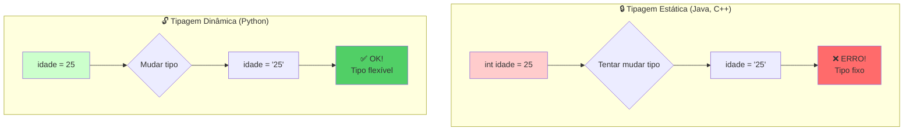
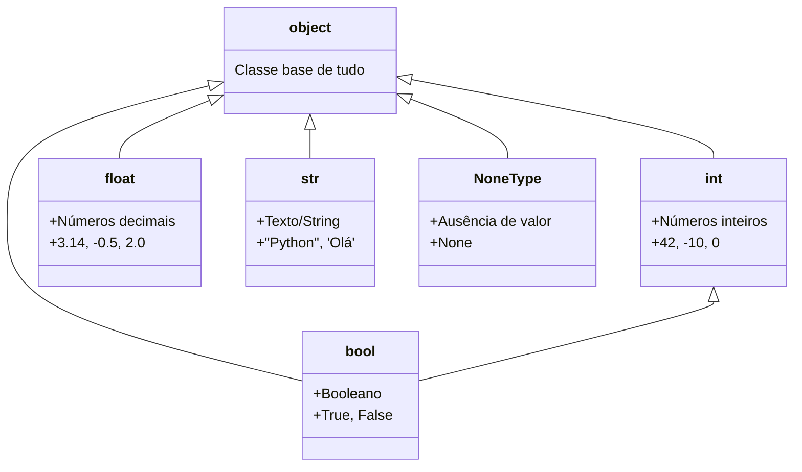
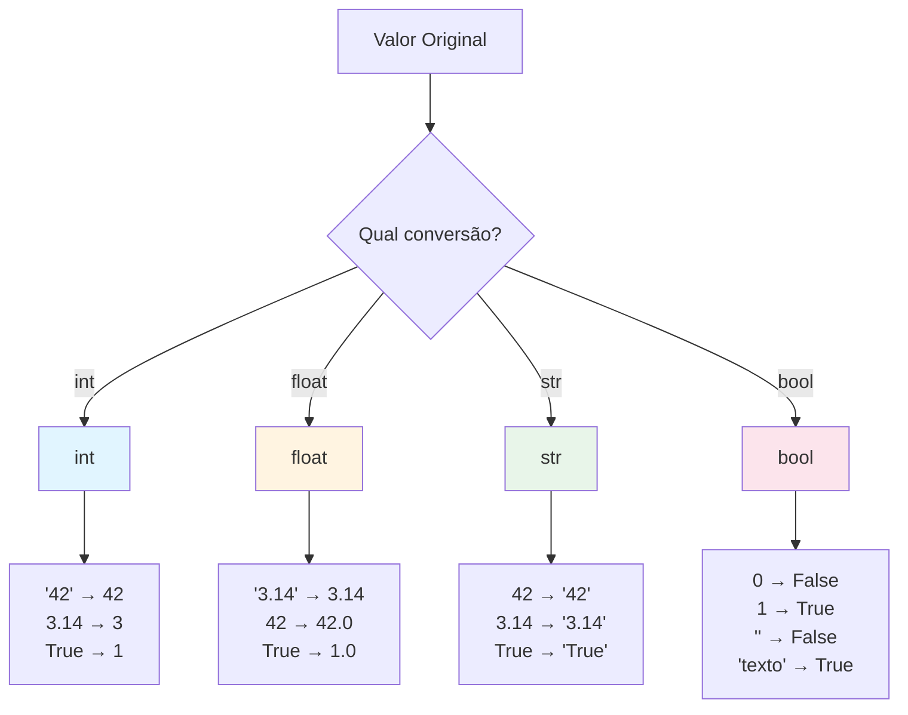
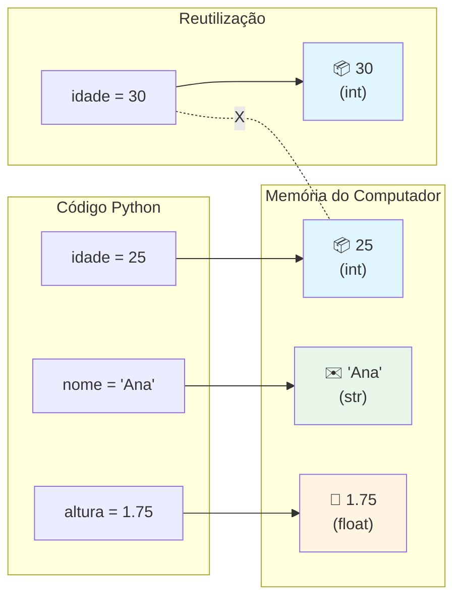
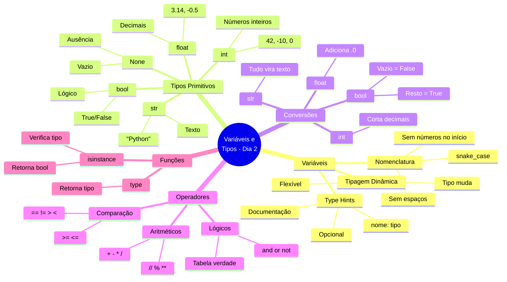

# 🐍 Python para Iniciantes - Dia 2: Variáveis e Tipos de Dados

---

## 📋 OBJETIVOS DE APRENDIZAGEM DO DIA

Ao final deste material, você será capaz de:

1. **Criar e utilizar** variáveis em Python com tipagem dinâmica
2. **Identificar e diferenciar** os 5 tipos primitivos: int, float, str, bool e None
3. **Converter** valores entre diferentes tipos usando int(), float(), str() e bool()
4. **Aplicar** operadores aritméticos, de comparação e lógicos em expressões
5. **Verificar** tipos de variáveis usando type() e isinstance()

---

## 🎭 ATIVAÇÃO DO CONHECIMENTO PRÉVIO

### 🔄 Revisão Rápida do Dia 1

Antes de começar, vamos relembrar o que você aprendeu:

**✅ Checkpoint Mental:**
- Você instalou Python e VSCode ✓
- Criou seu primeiro script com `print()` ✓
- Entendeu o que são comentários (`#`) ✓
- Aprendeu sobre ambientes virtuais (venv) ✓
- Executou código com `python script.py` ✓

**Conexão com Hoje:**
No Dia 1, você usou `print()` com textos fixos:
```python {.line-numbers}
print("Olá, mundo!")
print("Meu nome é Ana")
```

**Problema:** E se você quiser usar o nome "Ana" em vários lugares? Teria que digitar várias vezes!

**Solução de Hoje:** VARIÁVEIS! Você vai guardar informações e reutilizá-las:
```python {.line-numbers}
nome = "Ana"
print("Olá, mundo!")
print("Meu nome é", nome)
print(nome, "está aprendendo Python!")
```

---

### 🏭 Analogia Central: O Depósito de Caixas

Imagine que você trabalha em um **depósito gigante** que organiza diferentes tipos de objetos:

#### 🗄️ O Depósito (Memória do Computador)

Neste depósito:
- **Variáveis** são **etiquetas** que você cola nas caixas
- **Valores** são os **objetos** dentro das caixas
- **Tipos** são os **formatos das caixas** (caixa de sapatos, geladeira, envelope, etc.)

#### 📦 Tipos de Containers

1. **📦 Caixa de Números Inteiros (int):**
   - Guarda números sem vírgula: 1, 42, -10, 1000
   - Como uma caixa de sapatos com números escritos

2. **🎁 Caixa de Números Decimais (float):**
   - Guarda números com vírgula: 3.14, -0.5, 2.0
   - Como uma caixa de joias (mais precisa)

3. **✉️ Envelope de Texto (str):**
   - Guarda palavras e frases: "Python", "Olá!"
   - Como um envelope com carta dentro

4. **🔘 Interruptor Verdadeiro/Falso (bool):**
   - Guarda apenas True ou False
   - Como um interruptor: ligado ou desligado

5. **⭕ Caixa Vazia (None):**
   - Representa ausência de valor
   - Como uma etiqueta sem caixa

#### 🏷️ A Magia do Python: Etiquetas Flexíveis

**Diferença do Python para outras linguagens:**

Em linguagens como Java ou C++, você precisa dizer qual tipo de caixa vai usar ANTES:
```java
// Java (mais rígido)
int idade = 25;           // Só pode guardar números inteiros
String nome = "Ana";      // Só pode guardar texto
idade = "vinte e cinco";  // ❌ ERRO! Não pode mudar o tipo!
```

**No Python, as etiquetas são mágicas e flexíveis:**
```python {.line-numbers}
# Python (flexível)
idade = 25              # Começa como número
print(idade)            # 25
idade = "vinte e cinco" # Pode virar texto!
print(idade)            # vinte e cinco
```

**Analogia:** Em outras linguagens, a etiqueta está COLADA na caixa. No Python, a etiqueta é um POST-IT que você pode colar em qualquer caixa!

---

### 📖 História Introdutória: Alex, o Organizador

Alex trabalhava em uma biblioteca caótica. Livros espalhados, sem organização, impossível encontrar nada. Um dia, Alex teve uma ideia genial:

**Sistema de Organização:**
1. **Etiquetas coloridas** para cada tipo de livro
2. **Prateleiras específicas** para cada categoria
3. **Catálogo digital** para buscar rapidamente

Resultado? A biblioteca virou referência de organização!

**Conexão com Programação:**
- **Variáveis** são as etiquetas de Alex
- **Tipos de dados** são as categorias (ficção, não-ficção, infantil)
- **Memória do computador** é a biblioteca
- **Python** é o sistema que gerencia tudo automaticamente

Hoje, você vai aprender a ser como Alex: organizar informações de forma inteligente! 🎯

---

## 📚 APRESENTAÇÃO DO CONTEÚDO

### 🧩 Bloco 1: O que são Variáveis?

#### Definição Simples

**Variável** = Nome que você dá para um valor que quer guardar

**Sintaxe:**
```python {.line-numbers}
nome_da_variavel = valor
```

**Exemplos:**
```python {.line-numbers}
idade = 25
nome = "Maria"
altura = 1.75
estudante = True
```

---

#### 📊 Diagrama: Tipagem Dinâmica vs Estática



---

#### 🎯 Regras para Nomes de Variáveis

**✅ PODE:**
```python {.line-numbers}
nome = "Ana"
idade_usuario = 30
valor1 = 100
_privado = "secreto"
CONSTANTE = 3.14
meuNome = "Camel Case"
meu_nome = "Snake Case" # ⭐ Recomendado em Python!
```

**❌ NÃO PODE:**
```python {.line-numbers}
1nome = "Ana"        # ❌ Não pode começar com número
meu-nome = "Ana"     # ❌ Não pode ter hífen
meu nome = "Ana"     # ❌ Não pode ter espaço
class = "Python"     # ❌ Não pode usar palavras reservadas
```

**📝 Convenções (Boas Práticas):**
- Use `snake_case` (palavras separadas por `_`)
- Nomes descritivos: `idade_usuario` melhor que `x`
- Constantes em MAIÚSCULAS: `PI = 3.14159`
- Evite nomes muito longos: `idade` melhor que `idade_do_usuario_em_anos`

---

### 🧩 Bloco 2: Tipos Primitivos em Python

#### 📊 Hierarquia de Tipos



**Curiosidade:** `bool` herda de `int`! Por isso `True` vale 1 e `False` vale 0.

---

#### 1️⃣ Tipo: int (Inteiro)

**O que é:** Números sem vírgula (positivos, negativos ou zero)

**Exemplos:**
```python {.line-numbers}
idade = 25
temperatura = -5
pontos = 0
populacao = 1000000
ano = 2026
```

**Operações:**
```python {.line-numbers}
a = 10
b = 3

print(a + b)   # 13 (soma)
print(a - b)   # 7 (subtração)
print(a * b)   # 30 (multiplicação)
print(a / b)   # 3.333... (divisão - retorna float!)
print(a // b)  # 3 (divisão inteira - descarta decimais)
print(a % b)   # 1 (resto da divisão - módulo)
print(a ** b)  # 1000 (potência - 10³)
```

**Analogia:** int é como contar pessoas em uma sala. Você não pode ter 2.5 pessoas!

---

#### 2️⃣ Tipo: float (Ponto Flutuante)

**O que é:** Números com vírgula (decimais)

**Exemplos:**
```python {.line-numbers}
altura = 1.75
peso = 68.5
pi = 3.14159
temperatura = -3.2
preco = 19.90
```

**⚠️ Atenção:** Python usa PONTO (`.`) não vírgula (`,`)
```python {.line-numbers}
valor = 10.5   # ✅ Correto
valor = 10,5   # ❌ Isso cria uma tupla, não um float!
```

**Curiosidade sobre Precisão:**
```python {.line-numbers}
print(0.1 + 0.2)  # 0.30000000000000004 (não é exatamente 0.3!)
```

**Por quê?** Computadores armazenam números em binário, e alguns decimais não têm representação exata.

**Analogia:** float é como medir líquidos. Você pode ter 1.5 litros de água.

---

#### 📊 Tabela Comparativa: int vs float

| Característica | int | float |
|---------------|-----|-------|
| **Valores** | Números inteiros | Números decimais |
| **Exemplos** | 42, -10, 0 | 3.14, -0.5, 2.0 |
| **Precisão** | Exata | Aproximada |
| **Memória** | Menos | Mais |
| **Uso** | Contagens, índices | Medidas, cálculos científicos |
| **Divisão** | `10 // 3 = 3` | `10 / 3 = 3.333...` |

---

#### 3️⃣ Tipo: str (String/Texto)

**O que é:** Sequência de caracteres (letras, números, símbolos)

**Criando strings:**
```python {.line-numbers}
# Aspas simples
nome = 'Maria'

# Aspas duplas (mais comum)
mensagem = "Olá, mundo!"

# Aspas triplas (múltiplas linhas)
texto = """
Este é um texto
com várias linhas
muito útil!
"""

# String vazia
vazio = ""
```

**Quando usar aspas simples vs duplas?**
```python {.line-numbers}
# Use aspas duplas quando o texto tem aspas simples
frase = "Ele disse: 'Python é incrível!'"

# Use aspas simples quando o texto tem aspas duplas
frase = 'Ela respondeu: "Concordo totalmente!"'

# Ou use escape (\)
frase = "Ele disse: \"Python é incrível!\""
```

**Operações com Strings:**
```python {.line-numbers}
primeiro_nome = "Ana"
sobrenome = "Silva"

# Concatenação (juntar)
nome_completo = primeiro_nome + " " + sobrenome
print(nome_completo)  # Ana Silva

# Repetição
risada = "Ha" * 3
print(risada)  # HaHaHa

# Tamanho
print(len(nome_completo))  # 9 (conta espaços!)

# Maiúsculas/Minúsculas
print(nome_completo.upper())  # ANA SILVA
print(nome_completo.lower())  # ana silva
print(nome_completo.title())  # Ana Silva
```

**Caracteres Especiais:**
```python {.line-numbers}
print("Linha 1\nLinha 2")    # \n = nova linha
print("Nome:\tIdade")         # \t = tabulação (tab)
print("C:\Users\Ana")       # \ = barra invertida literal
```

**Analogia:** String é como um colar de contas. Cada caractere é uma conta, e você pode juntar colares (concatenar) ou contar as contas (len).

---

#### 4️⃣ Tipo: bool (Booleano)

**O que é:** Tipo lógico que representa verdadeiro ou falso

**Valores possíveis:** Apenas `True` ou `False` (com primeira letra MAIÚSCULA!)

**Exemplos:**
```python {.line-numbers}
esta_chovendo = True
tem_dinheiro = False
maior_de_idade = True
aprovado = False
```

**⚠️ Atenção à Capitalização:**
```python {.line-numbers}
correto = True    # ✅ Primeira letra maiúscula
errado = true     # ❌ Python não reconhece
errado = TRUE     # ❌ Também não funciona
```

**Operadores de Comparação (retornam bool):**
```python {.line-numbers}
idade = 18

print(idade == 18)   # True (igual a)
print(idade != 20)   # True (diferente de)
print(idade > 15)    # True (maior que)
print(idade < 30)    # True (menor que)
print(idade >= 18)   # True (maior ou igual)
print(idade <= 18)   # True (menor ou igual)
```

**Operadores Lógicos:**
```python {.line-numbers}
tem_carteira = True
maior_18 = True
tem_carro = False

# AND (e) - Ambos precisam ser True
pode_dirigir = tem_carteira and maior_18
print(pode_dirigir)  # True

pode_viajar = tem_carteira and tem_carro
print(pode_viajar)   # False

# OR (ou) - Pelo menos um precisa ser True
tem_transporte = tem_carro or tem_carteira
print(tem_transporte)  # True

# NOT (não) - Inverte o valor
nao_tem_carro = not tem_carro
print(nao_tem_carro)  # True
```

**Tabela Verdade - AND:**
| A | B | A and B |
|---|---|---------|
| True | True | True |
| True | False | False |
| False | True | False |
| False | False | False |

**Tabela Verdade - OR:**
| A | B | A or B |
|---|---|--------|
| True | True | True |
| True | False | True |
| False | True | True |
| False | False | False |

**Analogia:** Bool é como um interruptor de luz. Só tem dois estados: ligado (True) ou desligado (False).

---

#### 5️⃣ Tipo: None (Nenhum)

**O que é:** Representa ausência de valor

**Uso:**
```python {.line-numbers}
resultado = None  # Ainda não tem valor
print(resultado)  # None

# Verificar se é None
if resultado is None:
    print("Resultado ainda não foi calculado")
```

**Quando usar:**
- Inicializar variáveis que receberão valor depois
- Indicar que uma função não retornou nada
- Representar dados ausentes

**Analogia:** None é como uma caixa vazia com uma etiqueta. A etiqueta existe, mas não há nada dentro.

---

### 🧩 Bloco 3: Type Hints (Anotações de Tipo)

#### O que são Type Hints?

**Definição:** Dicas opcionais de tipo que você pode adicionar ao código

**Sintaxe:**
```python {.line-numbers}
nome_variavel: tipo = valor
```

**Exemplos:**
```python {.line-numbers}
# Sem type hints (Python tradicional)
idade = 25
nome = "Ana"
altura = 1.75

# Com type hints (Python moderno)
idade: int = 25
nome: str = "Ana"
altura: float = 1.75
aprovado: bool = True
resultado: None = None
```

**⚠️ IMPORTANTE:** Type hints são apenas DICAS! Python NÃO força o tipo:
```python {.line-numbers}
idade: int = 25
idade = "vinte e cinco"  # ✅ Python permite! (mas não é recomendado)
```

**Por que usar?**
1. **Documentação:** Deixa claro que tipo esperar
2. **IDEs:** VSCode dá melhores sugestões
3. **Detectar erros:** Ferramentas como `mypy` podem verificar
4. **Legibilidade:** Código mais fácil de entender

**Exemplo Prático:**
```python {.line-numbers}
# Sem type hints - não está claro
def calcular(a, b):
    return a + b

# Com type hints - muito mais claro!
def calcular(a: int, b: int) -> int:
    return a + b
```

**Analogia:** Type hints são como etiquetas descritivas em potes de cozinha. Você PODE colocar açúcar no pote escrito "sal", mas não é uma boa ideia!

---

### 🧩 Bloco 4: Conversão de Tipos (Type Casting)

#### Por que converter tipos?

**Situação comum:**
```python {.line-numbers}
idade = input("Qual sua idade? ")  # input() sempre retorna string!
print(idade + 5)  # ❌ ERRO! Não pode somar string com número
```

**Solução: Converter!**
```python {.line-numbers}
idade = input("Qual sua idade? ")
idade = int(idade)  # Converte string para int
print(idade + 5)    # ✅ Funciona!
```

---

#### 📊 Fluxograma de Conversões



---

#### 1️⃣ Converter para int()

**Sintaxe:** `int(valor)`

**Exemplos:**
```python {.line-numbers}
# String para int
texto = "42"
numero = int(texto)
print(numero)        # 42
print(type(numero))  # <class 'int'>

# Float para int (perde a parte decimal!)
decimal = 3.99
inteiro = int(decimal)
print(inteiro)  # 3 (não arredonda, apenas corta!)

# Bool para int
print(int(True))   # 1
print(int(False))  # 0
```

**⚠️ Cuidados:**
```python {.line-numbers}
# String com decimal não funciona diretamente
int("3.14")  # ❌ ERRO! ValueError

# Solução: converter para float primeiro
int(float("3.14"))  # ✅ 3

# String com texto não funciona
int("abc")  # ❌ ERRO! ValueError
```

---

#### 2️⃣ Converter para float()

**Sintaxe:** `float(valor)`

**Exemplos:**
```python {.line-numbers}
# String para float
texto = "3.14"
decimal = float(texto)
print(decimal)  # 3.14

# Int para float
inteiro = 42
decimal = float(inteiro)
print(decimal)  # 42.0

# Bool para float
print(float(True))   # 1.0
print(float(False))  # 0.0
```

---

#### 3️⃣ Converter para str()

**Sintaxe:** `str(valor)`

**Exemplos:**
```python {.line-numbers}
# Int para string
numero = 42
texto = str(numero)
print(texto)        # "42"
print(type(texto))  # <class 'str'>

# Float para string
decimal = 3.14
texto = str(decimal)
print(texto)  # "3.14"

# Bool para string
print(str(True))   # "True"
print(str(False))  # "False"

# Concatenar números com texto
idade = 25
mensagem = "Tenho " + str(idade) + " anos"
print(mensagem)  # Tenho 25 anos
```

**💡 Dica:** Use f-strings (veremos mais no Dia 3):
```python {.line-numbers}
idade = 25
mensagem = f"Tenho {idade} anos"  # Mais fácil!
print(mensagem)
```

---

#### 4️⃣ Converter para bool()

**Sintaxe:** `bool(valor)`

**Regra Geral:**
- Valores "vazios" ou zero → `False`
- Qualquer outro valor → `True`

**Exemplos:**
```python {.line-numbers}
# Números
print(bool(0))      # False
print(bool(1))      # True
print(bool(-5))     # True
print(bool(0.0))    # False
print(bool(3.14))   # True

# Strings
print(bool(""))     # False (string vazia)
print(bool("Olá"))  # True
print(bool(" "))    # True (espaço conta!)

# None
print(bool(None))   # False
```

**Tabela de Conversão para Bool:**
| Valor | bool(valor) |
|-------|-------------|
| `0` | False |
| `0.0` | False |
| `""` (string vazia) | False |
| `None` | False |
| `[]` (lista vazia) | False |
| Qualquer outro | True |

---

### 🧩 Bloco 5: Operadores em Python

#### 1️⃣ Operadores Aritméticos

```python {.line-numbers}
a = 10
b = 3

print(a + b)   # 13  - Adição
print(a - b)   # 7   - Subtração
print(a * b)   # 30  - Multiplicação
print(a / b)   # 3.333... - Divisão (sempre retorna float)
print(a // b)  # 3   - Divisão inteira (descarta decimais)
print(a % b)   # 1   - Módulo (resto da divisão)
print(a ** b)  # 1000 - Potenciação (10³)
```

**Ordem de Precedência (PEMDAS):**
1. **P**arênteses: `()`
2. **E**xponenciação: `**`
3. **M**ultiplicação/Divisão: `*`, `/`, `//`, `%`
4. **A**dição/**S**ubtração: `+`, `-`

**Exemplos:**
```python {.line-numbers}
resultado = 2 + 3 * 4
print(resultado)  # 14 (não 20!)

resultado = (2 + 3) * 4
print(resultado)  # 20
```

---

#### 2️⃣ Operadores de Comparação

Retornam sempre `True` ou `False`

```python {.line-numbers}
a = 10
b = 5

print(a == b)   # False - Igual a
print(a != b)   # True  - Diferente de
print(a > b)    # True  - Maior que
print(a < b)    # False - Menor que
print(a >= b)   # True  - Maior ou igual
print(a <= b)   # False - Menor ou igual
```

**⚠️ Cuidado com ==:**
```python {.line-numbers}
# Um = é atribuição
x = 5  # Atribui 5 para x

# Dois == é comparação
x == 5  # Verifica se x é igual a 5 (retorna True/False)
```

---

#### 3️⃣ Operadores Lógicos

Combinam expressões booleanas

```python {.line-numbers}
idade = 20
tem_carteira = True

# AND - Ambos devem ser True
pode_dirigir = (idade >= 18) and tem_carteira
print(pode_dirigir)  # True

# OR - Pelo menos um deve ser True
fim_de_semana = False
feriado = True
pode_descansar = fim_de_semana or feriado
print(pode_descansar)  # True

# NOT - Inverte o valor
esta_chovendo = False
esta_sol = not esta_chovendo
print(esta_sol)  # True
```

**Precedência:**
1. `not` (maior prioridade)
2. `and`
3. `or` (menor prioridade)

---

### 🧩 Bloco 6: Funções type() e isinstance()

#### 1️⃣ Função type()

**O que faz:** Retorna o tipo de uma variável

**Sintaxe:** `type(variavel)`

**Exemplos:**
```python {.line-numbers}
idade = 25
nome = "Ana"
altura = 1.75
aprovado = True
nada = None

print(type(idade))     # <class 'int'>
print(type(nome))      # <class 'str'>
print(type(altura))    # <class 'float'>
print(type(aprovado))  # <class 'bool'>
print(type(nada))      # <class 'NoneType'>
```

**Uso Prático:**
```python {.line-numbers}
valor = input("Digite um número: ")
print(f"Tipo: {type(valor)}")  # <class 'str'>

valor = int(valor)
print(f"Tipo após conversão: {type(valor)}")  # <class 'int'>
```

---

#### 2️⃣ Função isinstance()

**O que faz:** Verifica se uma variável é de um tipo específico

**Sintaxe:** `isinstance(variavel, tipo)`

**Retorna:** `True` ou `False`

**Exemplos:**
```python {.line-numbers}
idade = 25

print(isinstance(idade, int))    # True
print(isinstance(idade, str))    # False
print(isinstance(idade, float))  # False

# Verificar múltiplos tipos
numero = 3.14
print(isinstance(numero, (int, float)))  # True (é float)
```

**Diferença entre type() e isinstance():**
```python {.line-numbers}
idade = 25

# Usando type()
if type(idade) == int:
    print("É inteiro!")

# Usando isinstance() (RECOMENDADO)
if isinstance(idade, int):
    print("É inteiro!")
```

**Por que isinstance() é melhor?**
- Funciona com herança de classes (veremos mais tarde)
- Sintaxe mais limpa
- Permite verificar múltiplos tipos de uma vez

---

### 📊 Diagrama de Memória: Variáveis e Referências



**Explicação:**
1. Quando você cria `idade = 25`, Python:
   - Cria um objeto `25` na memória
   - Cria uma referência (etiqueta) chamada `idade`
   - Aponta `idade` para o objeto `25`

2. Quando você muda `idade = 30`:
   - Python cria um NOVO objeto `30`
   - Redireciona a etiqueta `idade` para o novo objeto
   - O objeto `25` antigo pode ser descartado (garbage collection)

**Analogia:** É como mudar o endereço em um GPS. O GPS (variável) continua o mesmo, mas aponta para um lugar diferente (valor).

---

## 💡 DEMONSTRAÇÃO E MODELAGEM

### Exemplo Completo: Sistema de Cadastro Simples

Vamos criar um programa que demonstra todos os conceitos:

```python {.line-numbers}
# ========================================
# SISTEMA DE CADASTRO DE USUÁRIO
# Demonstra: variáveis, tipos, conversões
# ========================================

# 1. DECLARAÇÃO DE VARIÁVEIS COM TYPE HINTS
nome: str = "Carlos Silva"
idade: int = 28
altura: float = 1.82
peso: float = 75.5
estudante: bool = True
empresa: None = None  # Ainda não trabalha

# 2. EXIBIR INFORMAÇÕES
print("=" * 50)
print("📋 CADASTRO DE USUÁRIO")
print("=" * 50)
print()

print(f"👤 Nome: {nome}")
print(f"🎂 Idade: {idade} anos")
print(f"📏 Altura: {altura}m")
print(f"⚖️  Peso: {peso}kg")
print(f"🎓 Estudante: {'Sim' if estudante else 'Não'}")
print()

# 3. CÁLCULOS (Operadores Aritméticos)
# IMC = peso / altura²
imc: float = peso / (altura ** 2)
print(f"📊 IMC: {imc:.2f}")  # :.2f limita a 2 casas decimais

# 4. COMPARAÇÕES (Operadores de Comparação)
maior_de_idade: bool = idade >= 18
print(f"🔞 Maior de idade: {maior_de_idade}")

# 5. LÓGICA (Operadores Lógicos)
pode_dirigir: bool = maior_de_idade and (idade >= 18)
print(f"🚗 Pode dirigir: {pode_dirigir}")

# 6. CONVERSÕES DE TIPO
print()
print("-" * 50)
print("🔄 DEMONSTRAÇÃO DE CONVERSÕES")
print("-" * 50)

# String para int
texto_idade = "30"
idade_convertida = int(texto_idade)
print(f"String '{texto_idade}' → int {idade_convertida}")

# Float para int
altura_int = int(altura)
print(f"Float {altura} → int {altura_int}")

# Int para string
idade_texto = str(idade)
print(f"Int {idade} → string '{idade_texto}'")

# Qualquer coisa para bool
print(f"bool(0) = {bool(0)}")
print(f"bool(1) = {bool(1)}")
print(f"bool('') = {bool('')}")
print(f"bool('texto') = {bool('texto')}")

# 7. VERIFICAÇÃO DE TIPOS
print()
print("-" * 50)
print("🔍 VERIFICAÇÃO DE TIPOS")
print("-" * 50)

print(f"type(nome) = {type(nome)}")
print(f"type(idade) = {type(idade)}")
print(f"type(altura) = {type(altura)}")
print(f"type(estudante) = {type(estudante)}")

print(f"isinstance(idade, int) = {isinstance(idade, int)}")
print(f"isinstance(altura, float) = {isinstance(altura, float)}")

print()
print("=" * 50)
print("✅ Cadastro concluído com sucesso!")
print("=" * 50)
```

---

### 🔍 Comparação Lado a Lado: Certo vs Errado

#### ❌ Código que NÃO funciona:
```python {.line-numbers}
# ERRO 1: Tentar somar tipos incompatíveis
idade = "25"
nova_idade = idade + 5  # ❌ TypeError!

# ERRO 2: Converter string não-numérica
texto = "abc"
numero = int(texto)  # ❌ ValueError!

# ERRO 3: Usar bool minúsculo
ativo = true  # ❌ NameError! (deve ser True)

# ERRO 4: Comparação com = ao invés de ==
if idade = 25:  # ❌ SyntaxError!
    print("Tem 25 anos")
```

#### ✅ Código CORRETO:
```python {.line-numbers}
# CORREÇÃO 1: Converter antes de somar
idade = "25"
nova_idade = int(idade) + 5  # ✅ 30

# CORREÇÃO 2: Validar antes de converter
texto = "abc"
if texto.isdigit():
    numero = int(texto)
else:
    print("Não é um número válido")

# CORREÇÃO 3: Bool com primeira letra maiúscula
ativo = True  # ✅ Correto

# CORREÇÃO 4: Usar == para comparação
if idade == 25:  # ✅ Correto
    print("Tem 25 anos")
```

---

## 🎯 PRÁTICA GUIADA

### Exercício Principal: Calculadora de Saúde Pessoal 💪

#### 📌 Contexto e Motivação

Você foi contratado por uma academia para criar um programa que calcula indicadores de saúde dos alunos. O programa deve calcular:
- **IMC (Índice de Massa Corporal)**
- **TMB (Taxa Metabólica Basal)** - calorias que você queima em repouso

Este exercício é perfeito porque:
- ✅ Usa todos os tipos de variáveis (int, float, str, bool)
- ✅ Pratica operadores aritméticos
- ✅ Trabalha com conversões de tipo
- ✅ Aplica operadores lógicos
- ✅ Resultado útil e motivador!

---

#### 🎯 Objetivo

Criar um programa que:
1. Armazena dados de uma pessoa (nome, idade, peso, altura, sexo)
2. Calcula o IMC
3. Calcula a TMB (fórmula diferente para homens e mulheres)
4. Exibe tudo formatado de forma bonita

---

#### 📋 Especificação Detalhada

**Fórmulas:**

**IMC:**
```
IMC = peso / (altura²)
```

**Classificação:**
- Abaixo de 18.5: Abaixo do peso
- 18.5 - 24.9: Peso normal
- 25.0 - 29.9: Sobrepeso
- 30.0 ou mais: Obesidade

**TMB (Taxa Metabólica Basal):**

*Homens:*
```
TMB = 88.36 + (13.4 × peso) + (4.8 × altura_cm) - (5.7 × idade)
```

*Mulheres:*
```
TMB = 447.6 + (9.2 × peso) + (3.1 × altura_cm) - (4.3 × idade)
```

---

#### 🏗️ Código Inicial (Esqueleto)

```python {.line-numbers}
# ========================================
# CALCULADORA DE SAÚDE PESSOAL
# ========================================

# 1. DADOS DO USUÁRIO
# TODO: Crie variáveis com type hints para:
# - nome (string)
# - idade (int)
# - peso (float, em kg)
# - altura (float, em metros)
# - sexo (string, "M" ou "F")

# 2. CÁLCULO DO IMC
# TODO: Calcule o IMC usando a fórmula: peso / (altura²)
# Dica: Use ** para potência

# 3. CÁLCULO DA TMB
# TODO: Calcule a TMB
# Dica: Primeiro converta altura para cm (altura * 100)
# Depois use if/else para escolher a fórmula (veremos if no Dia 3)
# Por enquanto, calcule apenas para um sexo

# 4. EXIBIÇÃO DOS RESULTADOS
# TODO: Exiba nome, idade, IMC e TMB formatados

print("=" * 50)
print("📊 RELATÓRIO DE SAÚDE")
print("=" * 50)
# ... seu código aqui ...
```

---

#### 💡 Dicas Progressivas

**🔓 Dica 1 (Declaração de Variáveis):**
```python {.line-numbers}
nome: str = "João Silva"
idade: int = 30
peso: float = 75.0
altura: float = 1.75
sexo: str = "M"
```

---

**🔓 Dica 2 (Cálculo do IMC):**
```python {.line-numbers}
# IMC = peso / altura²
imc: float = peso / (altura ** 2)
# ou
imc: float = peso / (altura * altura)
```

---

**🔓 Dica 3 (Conversão de Altura):**
```python {.line-numbers}
altura_cm: float = altura * 100
# Exemplo: 1.75m → 175cm
```

---

**🔓 Dica 4 (Cálculo da TMB - Homem):**
```python {.line-numbers}
# Fórmula para homens
tmb: float = 88.36 + (13.4 * peso) + (4.8 * altura_cm) - (5.7 * idade)
```

---

**🔓 Dica 5 (Formatação de Saída):**
```python {.line-numbers}
print(f"👤 Nome: {nome}")
print(f"🎂 Idade: {idade} anos")
print(f"📊 IMC: {imc:.2f}")  # :.2f = 2 casas decimais
print(f"🔥 TMB: {tmb:.0f} calorias/dia")  # :.0f = sem decimais
```

---

#### ✅ Solução Completa Comentada

```python {.line-numbers}
# ========================================
# CALCULADORA DE SAÚDE PESSOAL
# AUTOR: Seu Nome
# DATA: 2026-01-05
# ========================================

# 1. DADOS DO USUÁRIO (com type hints)
nome: str = "João Silva"
idade: int = 30
peso: float = 75.0  # em quilogramas
altura: float = 1.75  # em metros
sexo: str = "M"  # "M" para masculino, "F" para feminino

# 2. CÁLCULO DO IMC
# Fórmula: IMC = peso / altura²
imc: float = peso / (altura ** 2)

# 3. PREPARAÇÃO PARA TMB
# Converter altura de metros para centímetros
altura_cm: float = altura * 100

# 4. CÁLCULO DA TMB (Taxa Metabólica Basal)
# Usamos operador lógico para escolher a fórmula
eh_masculino: bool = (sexo == "M")

if eh_masculino:
    # Fórmula para homens: 88.36 + (13.4 × peso) + (4.8 × altura_cm) - (5.7 × idade)
    tmb: float = 88.36 + (13.4 * peso) + (4.8 * altura_cm) - (5.7 * idade)
else:
    # Fórmula para mulheres: 447.6 + (9.2 × peso) + (3.1 × altura_cm) - (4.3 × idade)
    tmb: float = 447.6 + (9.2 * peso) + (3.1 * altura_cm) - (4.3 * idade)

# 5. CLASSIFICAÇÃO DO IMC (usando comparações)
abaixo_peso: bool = imc < 18.5
peso_normal: bool = 18.5 <= imc < 25.0
sobrepeso: bool = 25.0 <= imc < 30.0
obesidade: bool = imc >= 30.0

# 6. EXIBIÇÃO DOS RESULTADOS
print("=" * 50)
print("📊 RELATÓRIO DE SAÚDE PESSOAL")
print("=" * 50)
print()

# Informações pessoais
print("👤 DADOS PESSOAIS:")
print(f"   Nome: {nome}")
print(f"   Idade: {idade} anos")
print(f"   Peso: {peso}kg")
print(f"   Altura: {altura}m")
print(f"   Sexo: {'Masculino' if eh_masculino else 'Feminino'}")
print()

# Resultados dos cálculos
print("📈 INDICADORES DE SAÚDE:")
print(f"   IMC: {imc:.2f}")

# Mostrar classificação do IMC
print("   Classificação: ", end="")
if abaixo_peso:
    print("Abaixo do peso")
elif peso_normal:
    print("Peso normal ✅")
elif sobrepeso:
    print("Sobrepeso ⚠️")
else:
    print("Obesidade ⚠️")

print(f"   TMB: {tmb:.0f} calorias/dia")
print()

# Informações adicionais
print("💡 INFORMAÇÕES:")
print(f"   • Você queima aproximadamente {tmb:.0f} calorias")
print("     apenas para manter o corpo funcionando em repouso.")
print()
print(f"   • Para manter o peso atual, consuma cerca de")
print(f"     {tmb * 1.2:.0f} calorias/dia (atividade leve).")
print()

# Verificação de tipos (demonstração)
print("🔍 VERIFICAÇÃO DE TIPOS:")
print(f"   type(nome) = {type(nome).__name__}")
print(f"   type(idade) = {type(idade).__name__}")
print(f"   type(imc) = {type(imc).__name__}")
print(f"   type(eh_masculino) = {type(eh_masculino).__name__}")
print()

print("=" * 50)
print("✅ Cálculos concluídos com sucesso!")
print("=" * 50)
```

---

#### 🎨 Variações Opcionais

**Variação 1: Adicionar Peso Ideal**
```python {.line-numbers}
# Calcular faixa de peso ideal para a altura
# Peso ideal mínimo: IMC 18.5
# Peso ideal máximo: IMC 24.9

peso_ideal_min: float = 18.5 * (altura ** 2)
peso_ideal_max: float = 24.9 * (altura ** 2)

print(f"⚖️  Faixa de peso ideal: {peso_ideal_min:.1f}kg - {peso_ideal_max:.1f}kg")
```

---

**Variação 2: Calcular Gasto Calórico por Atividade**
```python {.line-numbers}
# Multiplicadores de atividade
sedentario: float = tmb * 1.2
leve: float = tmb * 1.375
moderado: float = tmb * 1.55
intenso: float = tmb * 1.725
muito_intenso: float = tmb * 1.9

print("🏃 GASTO CALÓRICO POR NÍVEL DE ATIVIDADE:")
print(f"   Sedentário: {sedentario:.0f} cal/dia")
print(f"   Atividade leve: {leve:.0f} cal/dia")
print(f"   Atividade moderada: {moderado:.0f} cal/dia")
print(f"   Atividade intensa: {intenso:.0f} cal/dia")
print(f"   Muito intenso: {muito_intenso:.0f} cal/dia")
```

---

**Variação 3: Adicionar Conversões de Unidades**
```python {.line-numbers}
# Converter peso para libras
peso_libras: float = peso * 2.20462
print(f"⚖️  Peso: {peso}kg ({peso_libras:.1f} lbs)")

# Converter altura para pés e polegadas
altura_polegadas: float = altura * 39.3701
pes: int = int(altura_polegadas // 12)
polegadas: float = altura_polegadas % 12
print(f"📏 Altura: {altura}m ({pes}'{polegadas:.1f}\")")
```

---

#### 🌍 Conexão com o Mundo Real

**Onde este tipo de código é usado?**

1. **Aplicativos de Saúde:**
   - MyFitnessPal, Fitbit, Apple Health
   - Calculam IMC, calorias, macros

2. **Sistemas Hospitalares:**
   - Cálculo de dosagens de medicamentos
   - Monitoramento de pacientes

3. **E-commerce:**
   - Cálculo de preços com descontos
   - Conversão de moedas
   - Cálculo de frete

4. **Jogos:**
   - Cálculo de pontos, vida, dano
   - Estatísticas de personagens

**Habilidades desenvolvidas:**
- ✅ Trabalhar com diferentes tipos de dados
- ✅ Realizar cálculos matemáticos
- ✅ Converter entre tipos
- ✅ Usar operadores lógicos
- ✅ Formatar saídas

---

## 🔄 FEEDBACK E AVALIAÇÃO

### ✅ Checklist de Conceitos

Marque cada item conforme domina:

**Variáveis:**
- [ ] Sei criar variáveis com `nome = valor`
- [ ] Entendo que Python tem tipagem dinâmica
- [ ] Conheço as regras para nomes de variáveis
- [ ] Sei usar type hints opcionalmente

**Tipos Primitivos:**
- [ ] Entendo o tipo `int` (números inteiros)
- [ ] Entendo o tipo `float` (números decimais)
- [ ] Entendo o tipo `str` (texto)
- [ ] Entendo o tipo `bool` (True/False)
- [ ] Entendo o tipo `None` (ausência de valor)

**Conversões:**
- [ ] Sei converter para int com `int()`
- [ ] Sei converter para float com `float()`
- [ ] Sei converter para str com `str()`
- [ ] Sei converter para bool com `bool()`
- [ ] Entendo quando cada conversão falha

**Operadores:**
- [ ] Domino operadores aritméticos (+, -, *, /, //, %, **)
- [ ] Domino operadores de comparação (==, !=, >, <, >=, <=)
- [ ] Domino operadores lógicos (and, or, not)
- [ ] Entendo precedência de operadores

**Funções de Tipo:**
- [ ] Sei usar `type()` para verificar tipos
- [ ] Sei usar `isinstance()` para validar tipos
- [ ] Entendo a diferença entre as duas

---

### 🐛 Erros Comuns de Tipos

#### ❌ Erro 1: TypeError - Operação entre tipos incompatíveis

**Código:**
```python {.line-numbers}
idade = "25"
nova_idade = idade + 5
# TypeError: can only concatenate str (not "int") to str
```

**Causa:** Tentou somar string com número

**Solução:**
```python {.line-numbers}
idade = "25"
nova_idade = int(idade) + 5  # Converter para int primeiro
```

---

#### ❌ Erro 2: ValueError - Conversão inválida

**Código:**
```python {.line-numbers}
texto = "abc"
numero = int(texto)
# ValueError: invalid literal for int() with base 10: 'abc'
```

**Causa:** Tentou converter texto não-numérico para número

**Solução:**
```python {.line-numbers}
texto = "abc"
if texto.isdigit():
    numero = int(texto)
else:
    print("Não é um número válido")
```

---

#### ❌ Erro 3: NameError - Bool com letra minúscula

**Código:**
```python {.line-numbers}
ativo = true
# NameError: name 'true' is not defined
```

**Causa:** `true` não existe em Python, deve ser `True`

**Solução:**
```python {.line-numbers}
ativo = True  # Primeira letra MAIÚSCULA
```

---

#### ❌ Erro 4: SyntaxError - Usar = ao invés de ==

**Código:**
```python {.line-numbers}
if idade = 25:
    print("Tem 25 anos")
# SyntaxError: invalid syntax
```

**Causa:** Usou `=` (atribuição) ao invés de `==` (comparação)

**Solução:**
```python {.line-numbers}
if idade == 25:  # Dois sinais de igual
    print("Tem 25 anos")
```

---

#### ❌ Erro 5: Divisão por zero

**Código:**
```python {.line-numbers}
resultado = 10 / 0
# ZeroDivisionError: division by zero
```

**Causa:** Tentou dividir por zero

**Solução:**
```python {.line-numbers}
divisor = 0
if divisor != 0:
    resultado = 10 / divisor
else:
    print("Erro: não é possível dividir por zero")
```

---

### 📝 Quiz de Fixação

**Questão 1:** Qual será a saída do código abaixo?
```python {.line-numbers}
x = 10
y = 3
print(x // y)
```

<details>
<summary>Resposta</summary>
**Resposta: 3**

`//` é divisão inteira, que descarta a parte decimal. 10 ÷ 3 = 3.333..., mas `//` retorna apenas 3.
</details>

---

**Questão 2:** O que acontece neste código?
```python {.line-numbers}
idade = "25"
print(idade + 5)
```

<details>
<summary>Resposta</summary>
**Resposta: TypeError**

Não é possível somar string com número. Seria necessário converter: `int(idade) + 5`
</details>

---

**Questão 3:** Qual é o tipo de `resultado`?
```python {.line-numbers}
resultado = 10 / 2
```

<details>
<summary>Resposta</summary>
**Resposta: float**

A divisão `/` SEMPRE retorna float, mesmo quando o resultado é um número inteiro. `resultado` será `5.0` (float), não `5` (int).
</details>

---

**Questão 4:** Qual será a saída?
```python {.line-numbers}
print(bool(""))
print(bool("False"))
```

<details>
<summary>Resposta</summary>
**Resposta:**
```
False
True
```

String vazia (`""`) é `False`. Mas string com conteúdo (mesmo que seja a palavra "False") é `True`!
</details>

---

**Questão 5:** O que este código imprime?
```python {.line-numbers}
x = 5
y = 10
print(x > 3 and y < 20)
```

<details>
<summary>Resposta</summary>
**Resposta: True**

`x > 3` é True (5 > 3) E `y < 20` é True (10 < 20). True AND True = True.
</details>

---

### 🤔 Auto-Avaliação

**1. Explique com suas palavras: O que é tipagem dinâmica?**
<details>
<summary>Resposta esperada</summary>
Tipagem dinâmica significa que em Python você não precisa declarar o tipo da variável antecipadamente. O tipo é determinado automaticamente pelo valor atribuído, e pode mudar durante a execução do programa.
</details>

---

**2. Qual a diferença entre `10 / 3` e `10 // 3`?**
<details>
<summary>Resposta esperada</summary>
`10 / 3` é divisão normal e retorna `3.333...` (float). `10 // 3` é divisão inteira e retorna `3` (int), descartando a parte decimal.
</details>

---

**3. Por que `print("5" + "3")` funciona mas `print("5" + 3)` não?**
<details>
<summary>Resposta esperada</summary>
`"5" + "3"` funciona porque ambos são strings, e `+` concatena (junta) strings, resultando em `"53"`. `"5" + 3` não funciona porque Python não sabe se deve somar numericamente ou concatenar como texto - são tipos incompatíveis.
</details>

---

**4. O que acontece quando você faz `int(3.99)`?**
<details>
<summary>Resposta esperada</summary>
Retorna `3`. A conversão para int CORTA a parte decimal, não arredonda. Se quiser arredondar, use `round(3.99)` antes de converter.
</details>

---

**5. Qual a diferença entre `type()` e `isinstance()`?**
<details>
<summary>Resposta esperada</summary>
`type(x)` retorna o tipo exato de x. `isinstance(x, tipo)` verifica se x é do tipo especificado e retorna True/False. `isinstance()` é preferível porque funciona melhor com herança de classes e permite verificar múltiplos tipos.
</details>

---

## 🚀 TRANSFERÊNCIA E APLICAÇÃO

### 🏆 Desafio Bônus: Conversor Universal de Unidades

**Nível 1: Conversor de Temperatura**

Crie um programa que converte temperatura entre Celsius, Fahrenheit e Kelvin.

**Fórmulas:**
```
Fahrenheit = (Celsius × 9/5) + 32
Kelvin = Celsius + 273.15
```

**Código Inicial:**
```python {.line-numbers}
# Temperatura em Celsius
celsius: float = 25.0

# TODO: Calcular Fahrenheit e Kelvin
# TODO: Exibir os três valores formatados
```

---

**Nível 2: Conversor de Distância**

Adicione conversões de distância:
- Quilômetros ↔ Milhas
- Metros ↔ Pés
- Centímetros ↔ Polegadas

**Fatores de conversão:**
```
1 km = 0.621371 milhas
1 metro = 3.28084 pés
1 cm = 0.393701 polegadas
```

---

**Nível 3: Conversor Completo**

Crie um menu com todas as conversões:
- Temperatura
- Distância
- Peso (kg ↔ lbs)
- Volume (litros ↔ galões)

---

### 🔗 Preparação para o Dia 3

**No Dia 3, você aprenderá:**

1. **input()** - Pedir informações ao usuário
   - Hoje: Valores fixos no código
   - Amanhã: `nome = input("Qual seu nome? ")`

2. **if/elif/else** - Tomar decisões
   - Hoje: Calculamos tudo
   - Amanhã: Executar código apenas em certas condições

3. **F-strings** - Formatação avançada de texto
   - Hoje: `print(f"{imc:.2f}")`
   - Amanhã: Dominar todas as opções de formatação

4. **Programas Interativos**
   - Hoje: Programas estáticos
   - Amanhã: Programas que conversam com o usuário!

**Prepare-se para criar programas que reagem às suas escolhas! 🎮**

---

### 📚 Recursos Extras

#### 📖 Documentação Oficial
- [Tipos Embutidos do Python](https://docs.python.org/pt-br/3/library/stdtypes.html)
- [PEP 484 - Type Hints](https://peps.python.org/pep-0484/)

#### 🎥 Vídeos Recomendados
- "Variáveis e Tipos de Dados em Python" - Curso em Vídeo
- "Python Type Hints" - Tech With Tim

#### 🎮 Prática Interativa
- [Python Tutor](http://pythontutor.com/) - Visualize código executando
- [Repl.it](https://replit.com/) - IDE online para praticar

#### 📚 Leitura Complementar
- "Fluent Python" - Capítulo sobre tipos de dados
- "Python Tricks" - Dan Bader

---

## 🎊 CONCLUSÃO E MAPA MENTAL

### 📊 Mapa Mental dos Conceitos do Dia



---

### 🏅 Parabéns por Completar o Dia 2!

Hoje você deu um salto gigante! Você aprendeu:

✅ Como criar e usar variáveis
✅ Os 5 tipos primitivos de Python
✅ Converter entre tipos diferentes
✅ Usar operadores aritméticos, de comparação e lógicos
✅ Verificar tipos com type() e isinstance()
✅ Criar um programa real (Calculadora de Saúde)

**Você está construindo uma base sólida!** 🚀

---

### 💭 Reflexão Final

> "Dados são o novo petróleo, mas informação é o novo combustível." - Adaptado

Hoje você aprendeu a trabalhar com **dados** - a matéria-prima da programação. Variáveis são como containers que guardam esses dados, e tipos são as etiquetas que nos dizem o que há dentro.

**Lembre-se:**
- ✅ Python é flexível com tipos (tipagem dinâmica)
- ✅ Conversões são suas amigas (mas cuidado com erros!)
- ✅ Operadores são ferramentas poderosas
- ✅ Prática leva à perfeição

---

### 🎯 Tarefa de Casa

**Hoje:**
1. Refaça o exercício da Calculadora de Saúde com SEUS dados
2. Experimente as variações opcionais
3. Tente o Desafio Bônus (Conversor de Unidades)

**Amanhã:**
1. Revise rapidamente este material (10 minutos)
2. Comece o Dia 3: Input e Estruturas Condicionais
3. Prepare-se para criar programas interativos!

**Esta semana:**
1. Pratique 30 minutos por dia
2. Anote dúvidas e pesquise
3. Compartilhe seu progresso

---

### 🌟 Mensagem Final

Você acabou de dominar os **blocos de construção** fundamentais da programação! Variáveis e tipos de dados são a base de TUDO que você vai criar daqui para frente.

Pense nisso: todo aplicativo que você usa - Instagram, WhatsApp, YouTube - é feito de variáveis guardando dados e operadores manipulando esses dados. Você agora entende como isso funciona! 🤯

**Continue essa jornada incrível! Amanhã seus programas ganharão vida com interatividade!** 🎉

---

**Até o Dia 3! Prepare-se para conversar com seus programas! 💬🐍**

---

*Material criado com ❤️ para iniciantes em programação*
*Versão 1.0 - Janeiro 2026*